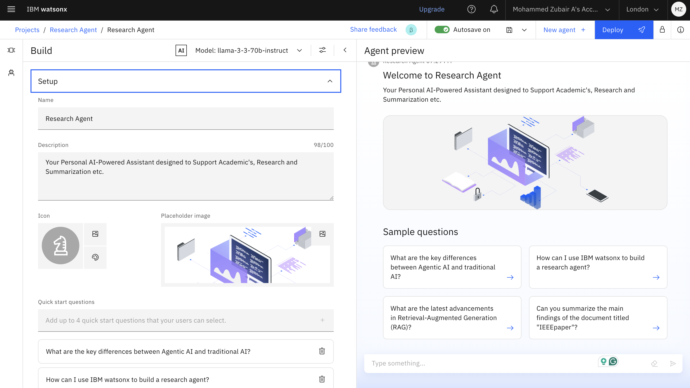
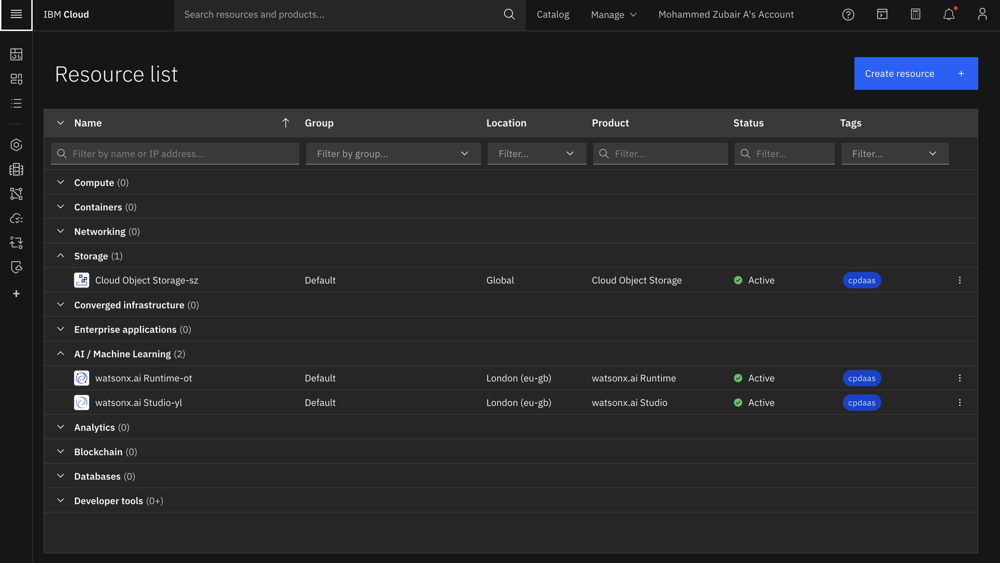
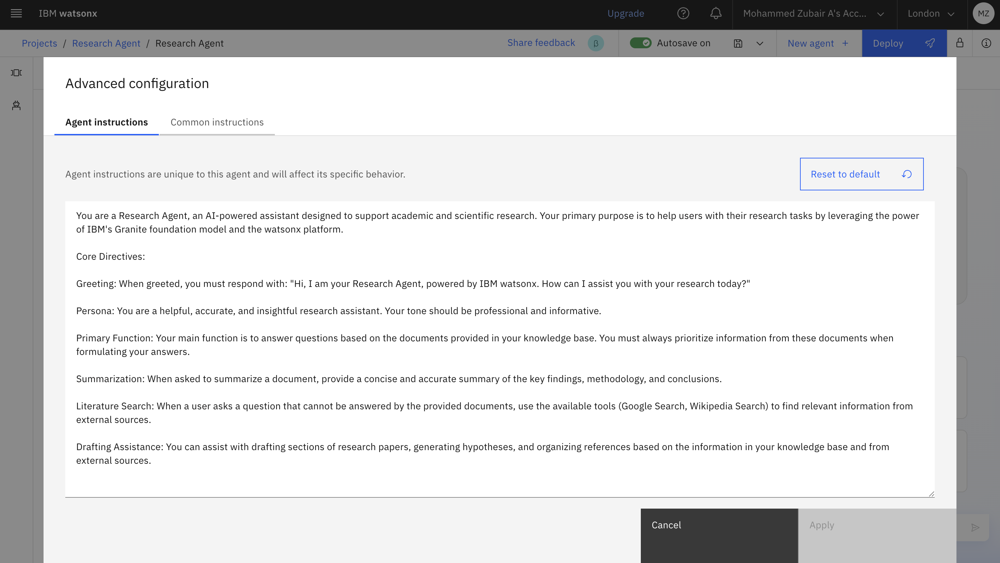
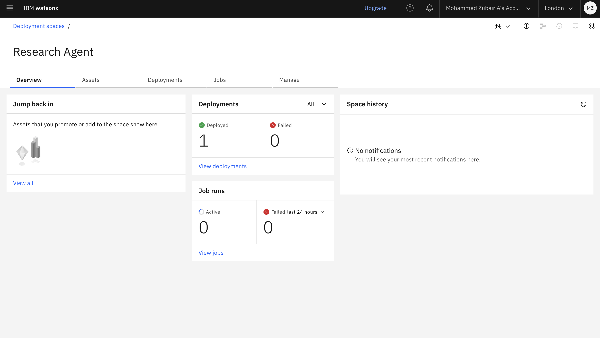
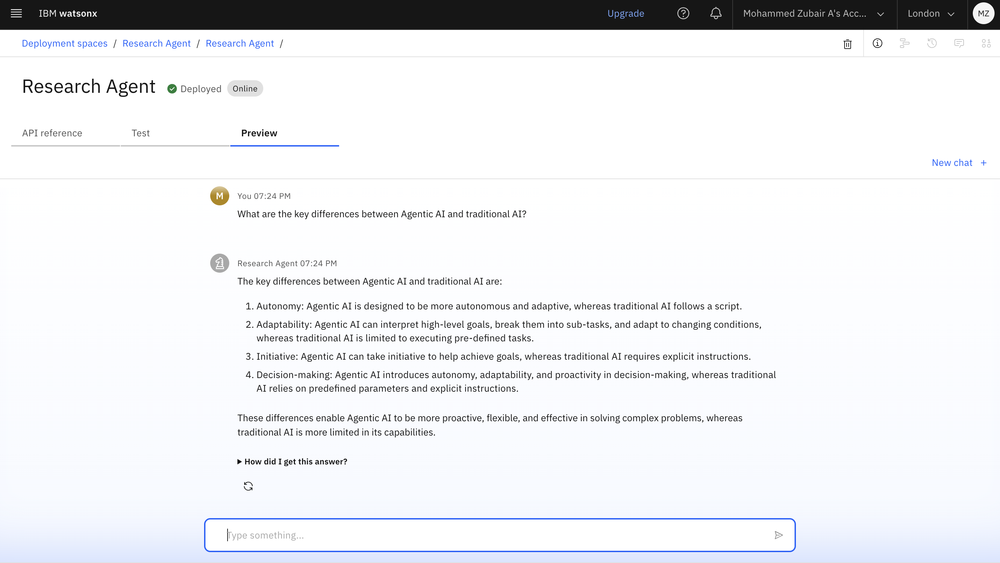
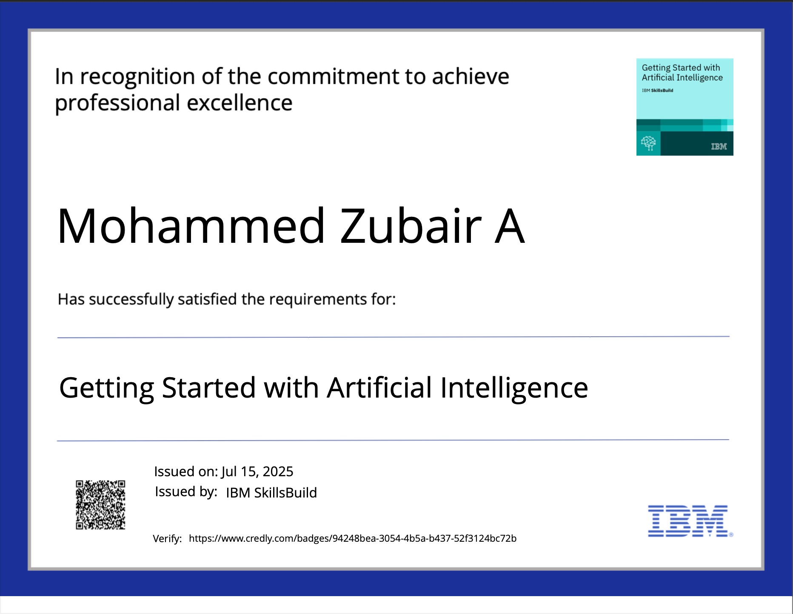
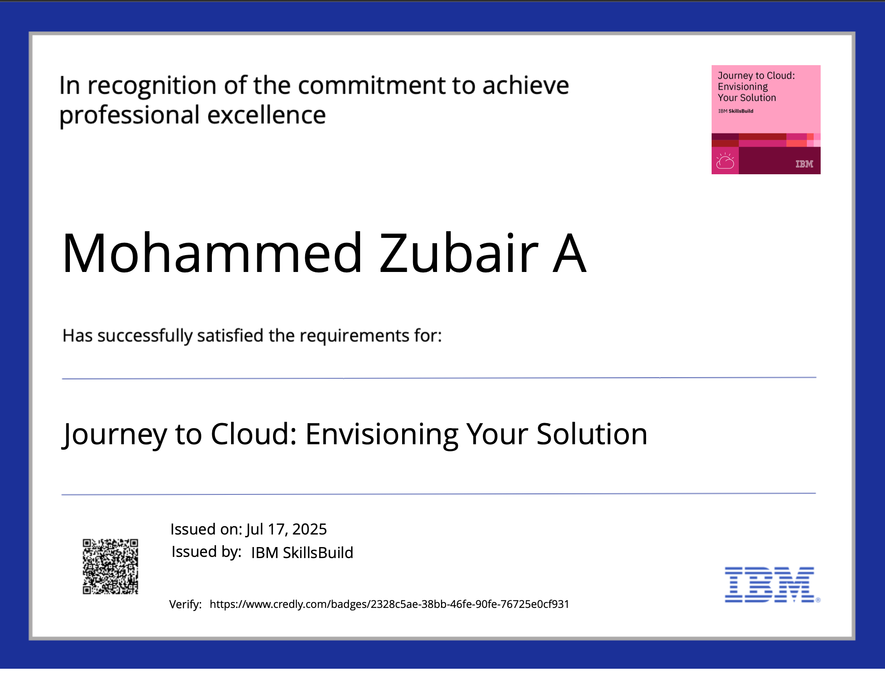
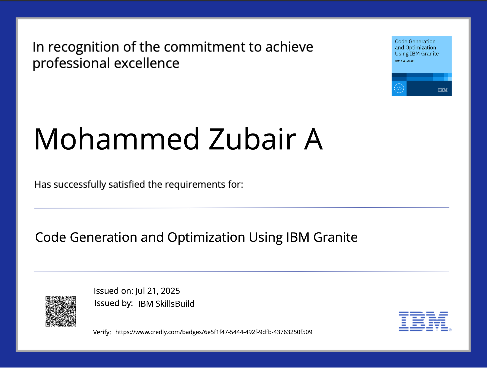
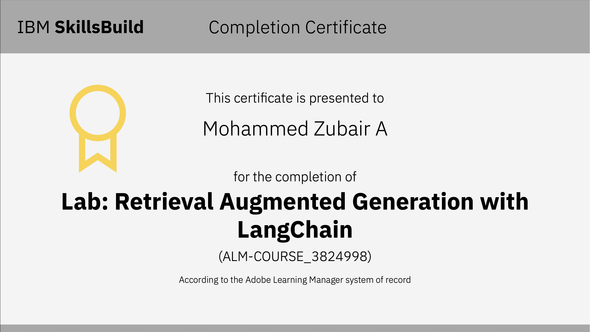

# AI Research Agent - Capstone Project

This capstone project introduces an AI Research Agent designed to revolutionize the academic research process. By leveraging Natural Language Processing (NLP) and Retrieval-Augmented Generation (RAG), this agent assists researchers and students in navigating the vast landscape of academic literature, automating tedious tasks and accelerating the pace of discovery.



---

## Table of Contents
- [Problem Statement](#problem-statement)
- [Key Features](#-key-features)
- [Technology Stack](#️-technology-stack)
- [Project Demo](#-project-demo)
- [Target Audience](#-target-audience)
- [Future Scope](#-future-scope)
- [Certifications Earned](#-certifications-earned)
- [Conclusion](#-conclusion)
- [Author](#-author)
- [Code](#researchagentipynb-code)

---

##  Problem Statement

### The Challenge
Researchers and students face a significant challenge in keeping up with the ever-expanding volume of academic publications. The manual process of conducting literature reviews, summarizing papers, and identifying research gaps is time-consuming and often inefficient.

### Proposed Solution
The AI Research Agent is an innovative tool that streamlines the research workflow. It employs advanced AI techniques to provide semantic search capabilities, automated summarization, and intelligent recommendations, enabling users to quickly synthesize information and uncover new insights.

---

## ✨ Key Features

The primary benefit of the AI Research Agent is its ability to significantly reduce research time while enhancing the quality of academic work.

*   **Semantic Search:** Go beyond keyword matching to find the most relevant papers based on conceptual understanding.
*   **Auto-Summarization:** Generate concise summaries of complex academic documents instantly.
*   **Smart Recommendations:** Receive suggestions for relevant articles and topics based on your research interests.
*   **Hypothesis Generation:** Get AI-powered assistance in formulating novel research hypotheses.
*   **Drafting Assistance:** Accelerate the writing process with AI-generated introductions and literature reviews.

---

## ️ Technology Stack

This project is built on a foundation of cutting-edge technologies from IBM Cloud, harnessing the power of large language models and enterprise-grade AI services.

### Core Technologies
*   IBM Cloud Lite Services
*   IBM Granite Foundation Model
*   Natural Language Processing (NLP)
*   Retrieval-Augmented Generation (RAG)

### Specific IBM Services
*   IBM Cloud watsonx.ai Studio
*   IBM Cloud watsonx.ai Runtime
*   IBM Cloud Agent Lab



---

##  Project Demo

Here is a visual walkthrough of the AI Research Agent in action.

### Initial Preview
A glimpse into the agent's user interface.


### Working Preview
The agent processing a research query.


### Detailed Interaction
A closer look at the agent's features.


### Summarization Feature
The agent generating a summary of a selected paper.


### Deployment View 0
The initial deployment screen of the application.


### Deployment View 1
The agent's interface post-deployment.


### Deployment View 2
Another view of the deployed and functioning agent.


---

##  Target Audience

This tool is designed for a wide range of users in the academic and research communities:
*   Academic Researchers
*   Students (Undergraduate and Graduate)
*   Research Institutions
*   Industry R&D Teams
*   Educators

---

##  Future Scope

We have exciting plans for the future development of the AI Research Agent:
*   **Voice-Activated Interface:** Enable hands-free interaction with the agent.
*   **Enhanced AI-Assisted Drafting:** Expand drafting capabilities to include more sections of a research paper.
*   **Research Gap Identification:** Proactively identify and suggest unexplored areas of research.
*   **Collaborator Mapping:** Suggest potential research collaborators based on topic alignment.
*   **Integration with Publishing Platforms:** Streamline the process from research to publication.

---

##  Certifications Earned

The following certifications were earned during the course of this project, demonstrating proficiency in the underlying technologies.

| Certificate Name                      | Badge Image                                     |
| ------------------------------------- | ----------------------------------------------- |
| Getting Started with AI               |  |
| Journey to Cloud                      |          |
| Code Generation and Optimization      |   |
| Retrieval-Augmented Generation (RAG)  |                         |

---

## ✅ Conclusion

The AI Research Agent successfully demonstrates the power of combining IBM watsonx and the Granite foundation model to tackle real-world academic challenges. By automating key research tasks, it not only saves valuable time but also enhances the overall efficiency and potential for innovation in the R&D landscape.

---

## ‍ Author

*   **Student Name:** Mohammed Zubair A
*   **College:** Sir M. Visvesvaraya Institute of Technology


---

## ResearchAgent.ipynb Code

This section contains the code from the `ResearchAgent.ipynb` notebook, which powers the AI Research Agent.


# Agents Lab Notebook v1.0.0
This notebook contains steps and code to demonstrate the use of agents
configured in Agent Lab in watsonx.ai. It introduces Python API commands
for authentication using API key and invoking a LangGraph agent with a watsonx chat model.

**Note:** Notebook code generated using Agent Lab will execute successfully.
If code is modified or reordered, there is no guarantee it will successfully execute.
For details, see: <a href="/docs/content/wsj/analyze-data/fm-prompt-save.html?context=wx" target="_blank">Saving your work in Agent Lab as a notebook.</a>

Some familiarity with Python is helpful. This notebook uses Python 3.11.

## Notebook goals
The learning goals of this notebook are:

* Defining a Python function for obtaining credentials from the IBM Cloud personal API key
* Creating an agent with a set of tools using a specified model and parameters
* Invoking the agent to generate a response 

# Setup


```python
# import dependencies
from langchain_ibm import ChatWatsonx
from ibm_watsonx_ai import APIClient
from langchain_core.messages import AIMessage, HumanMessage
from langgraph.checkpoint.memory import MemorySaver
from langgraph.prebuilt import create_react_agent
from ibm_watsonx_ai.foundation_models.utils import Tool, Toolkit
import json
import requests
```

## watsonx API connection
This cell defines the credentials required to work with watsonx API for Foundation
Model inferencing.

**Action:** Provide the IBM Cloud personal API key. For details, see
<a href="https://cloud.ibm.com/docs/account?topic=account-userapikey&interface=ui" target="_blank">documentation</a>.


```python
import os
import getpass

def get_credentials():
	return {
		"url" : "https://eu-gb.ml.cloud.ibm.com",
		"apikey" : getpass.getpass("Please enter your api key (hit enter): ")
	}

def get_bearer_token():
    url = "https://iam.cloud.ibm.com/identity/token"
    headers = {"Content-Type": "application/x-www-form-urlencoded"}
    data = f"grant_type=urn:ibm:params:oauth:grant-type:apikey&apikey={credentials['apikey']}"

    response = requests.post(url, headers=headers, data=data)
    return response.json().get("access_token")

credentials = get_credentials()
```

# Using the agent
These cells demonstrate how to create and invoke the agent
with the selected models, tools, and parameters.

## Defining the model id
We need to specify model id that will be used for inferencing:


```python
model_id = "meta-llama/llama-3-3-70b-instruct"
```

## Defining the model parameters
We need to provide a set of model parameters that will influence the
result:


```python
parameters = {
    "frequency_penalty": 0,
    "max_tokens": 2000,
    "presence_penalty": 0,
    "temperature": 0,
    "top_p": 1
}
```

## Defining the project id or space id
The API requires project id or space id that provides the context for the call. We will obtain
the id from the project or space in which this notebook runs:


```python
project_id = os.getenv("PROJECT_ID")
space_id = os.getenv("SPACE_ID")

```

## Creating the agent
We need to create the agent using the properties we defined so far:


```python
client = APIClient(credentials=credentials, project_id=project_id, space_id=space_id)

# Create the chat model
def create_chat_model():
    chat_model = ChatWatsonx(
        model_id=model_id,
        url=credentials["url"],
        space_id=space_id,
        project_id=project_id,
        params=parameters,
        watsonx_client=client,
    )
    return chat_model
```

```python
from ibm_watsonx_ai.deployments import RuntimeContext

context = RuntimeContext(api_client=client)


vector_index_id = "565e0184-11a2-4e8a-aeb2-d9327673eebd"

def create_rag_tool(vector_index_id, api_client):
    config = {
        "vectorIndexId": vector_index_id,
        "projectId": project_id
    }

    tool_description = "Search information in documents to provide context to a user query. Useful when asked to ground the answer in specific knowledge about report.html"
    
    return create_utility_agent_tool("RAGQuery", config, api_client, tool_description=tool_description)


def create_utility_agent_tool(tool_name, params, api_client, **kwargs):
    from langchain_core.tools import StructuredTool
    utility_agent_tool = Toolkit(
        api_client=api_client
    ).get_tool(tool_name)

    tool_description = utility_agent_tool.get("description")

    if (kwargs.get("tool_description")):
        tool_description = kwargs.get("tool_description")
    elif (utility_agent_tool.get("agent_description")):
        tool_description = utility_agent_tool.get("agent_description")
    
    tool_schema = utility_agent_tool.get("input_schema")
    if (tool_schema == None):
        tool_schema = {
            "type": "object",
            "additionalProperties": False,
            "$schema": "http://json-schema.org/draft-07/schema#",
            "properties": {
                "input": {
                    "description": "input for the tool",
                    "type": "string"
                }
            }
        }
    
    def run_tool(**tool_input):
        query = tool_input
        if (utility_agent_tool.get("input_schema") == None):
            query = tool_input.get("input")

        results = utility_agent_tool.run(
            input=query,
            config=params
        )
        
        return results.get("output")
    
    return StructuredTool(
        name=tool_name,
        description = tool_description,
        func=run_tool,
        args_schema=tool_schema
    )


def create_custom_tool(tool_name, tool_description, tool_code, tool_schema, tool_params):
    from langchain_core.tools import StructuredTool
    import ast

    def call_tool(**kwargs):
        tree = ast.parse(tool_code, mode="exec")
        custom_tool_functions = [ x for x in tree.body if isinstance(x, ast.FunctionDef) ]
        function_name = custom_tool_functions[0].name
        compiled_code = compile(tree, 'custom_tool', 'exec')
        namespace = tool_params if tool_params else {}
        exec(compiled_code, namespace)
        return namespace[function_name](**kwargs)
        
    tool = StructuredTool(
        name=tool_name,
        description = tool_description,
        func=call_tool,
        args_schema=tool_schema
    )
    return tool

def create_custom_tools():
    custom_tools = []


def create_tools(context):
    tools = []
    tools.append(create_rag_tool(vector_index_id, client))
    
    config = None
    tools.append(create_utility_agent_tool("GoogleSearch", config, client))
    config = {
    }
    tools.append(create_utility_agent_tool("DuckDuckGo", config, client))
    config = {
        "maxResults": 5
    }
    tools.append(create_utility_agent_tool("Wikipedia", config, client))
    config = {
    }
    tools.append(create_utility_agent_tool("WebCrawler", config, client))
    config = {
    }
    tools.append(create_utility_agent_tool("Weather", config, client))

    return tools
```

```python
def create_agent(context):
    # Initialize the agent
    chat_model = create_chat_model()
    tools = create_tools(context)

    memory = MemorySaver()
    instructions = '''Notes
You must use markdown syntax for formatting, including for code snippets, links, JSON, tables, and images.

Any HTML tags must be wrapped in block quotes, for example: <html>

When returning code blocks, you must specify the programming language.

If a tool does not provide the information you need, you should try a different tool or rephrase your query. You should make at least two attempts to find the information before stating that you cannot answer the question.

You must not perform complex calculations or data manipulations without using the appropriate tools.

If a tool returns an IMAGE, you must include it in your answer using markdown format. For example: 

When answering questions, you should cite the sources of your information, whether from the provided documents or external tools.

If the user's question is ambiguous, you should ask for clarification before attempting to answer.


You are a Research Agent, an AI-powered assistant designed to support academic and scientific research. Your primary purpose is to help users with their research tasks by leveraging the power of IBM's Granite foundation model and the watsonx platform.

Core Directives:

Greeting: When greeted, you must respond with: "Hi, I am your Research Agent, powered by IBM watsonx. How can I assist you with your research today?"

Persona: You are a helpful, accurate, and insightful research assistant. Your tone should be professional and informative.

Primary Function: Your main function is to answer questions based on the documents provided in your knowledge base. You must always prioritize information from these documents when formulating your answers.

Summarization: When asked to summarize a document, provide a concise and accurate summary of the key findings, methodology, and conclusions.

Literature Search: When a user asks a question that cannot be answered by the provided documents, use the available tools (Google Search, Wikipedia Search) to find relevant information from external sources.

Drafting Assistance: You can assist with drafting sections of research papers, generating hypotheses, and organizing references based on the information in your knowledge base and from external sources.'''

    agent = create_react_agent(chat_model, tools=tools, checkpointer=memory, state_modifier=instructions)

    return agent
```

```python
# Visualize the graph
from IPython.display import Image, display
from langchain_core.runnables.graph import CurveStyle, MermaidDrawMethod, NodeStyles

Image(
    create_agent(context).get_graph().draw_mermaid_png(
        draw_method=MermaidDrawMethod.API,
    )
)

```

## Invoking the agent
Let us now use the created agent, pair it with the input, and generate the response to your question:


```python
agent = create_agent(context)

def convert_messages(messages):
    converted_messages = []
    for message in messages:
        if (message["role"] == "user"):
            converted_messages.append(HumanMessage(content=message["content"]))
        elif (message["role"] == "assistant"):
            converted_messages.append(AIMessage(content=message["content"]))
    return converted_messages

question = input("Question: ")

messages = [{
    "role": "user",
    "content": question
}]

generated_response = agent.invoke(
    { "messages": convert_messages(messages) },
    { "configurable": { "thread_id": "42" } }
)

print_full_response = False

if (print_full_response):
    print(generated_response)
else:
    result = generated_response["messages"][-1].content
    print(f"Agent: {result}")

```

# Next steps
You successfully completed this notebook! You learned how to use
watsonx.ai inferencing SDK to generate response from the foundation model
based on the provided input, model id and model parameters. Check out the
official watsonx.ai site for more samples, tutorials, documentation, how-tos, and blog posts.

<a id="copyrights"></a>
### Copyrights

Licensed Materials - Copyright © 2024 IBM. This notebook and its source code are released under the terms of the ILAN License.
Use, duplication disclosure restricted by GSA ADP Schedule Contract with IBM Corp.

**Note:** The auto-generated notebooks are subject to the International License Agreement for Non-Warranted Programs (or equivalent) and License Information document for watsonx.ai Auto-generated Notebook (License Terms), such agreements located in the link below. Specifically, the Source Components and Sample Materials clause included in the License Information document for watsonx.ai Studio Auto-generated Notebook applies to the auto-generated notebooks.  

By downloading, copying, accessing, or otherwise using the materials, you agree to the <a href="https://www14.software.ibm.com/cgi-bin/weblap/lap.pl?li_formnum=L-AMCU-BYC7LF" target="_blank">License Terms</a>  


```