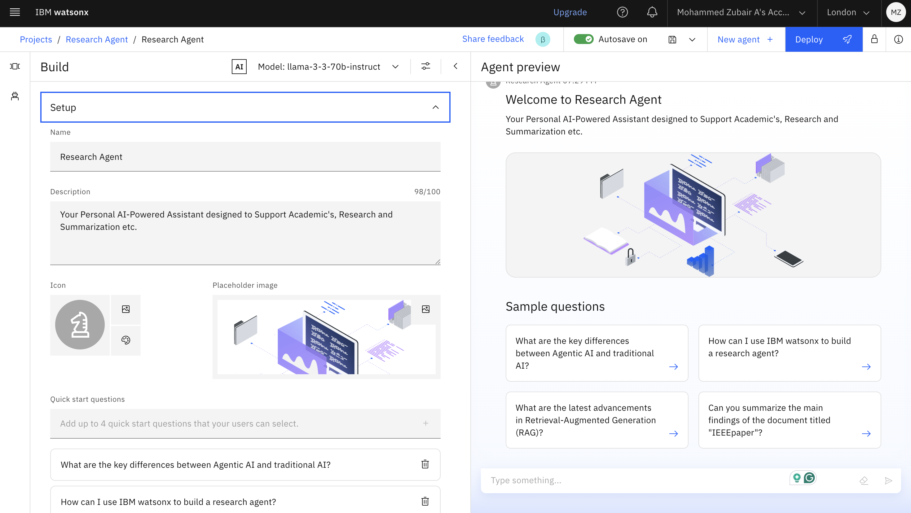
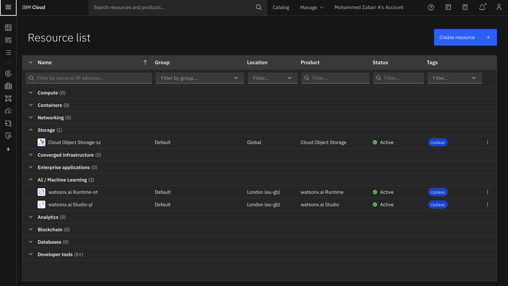
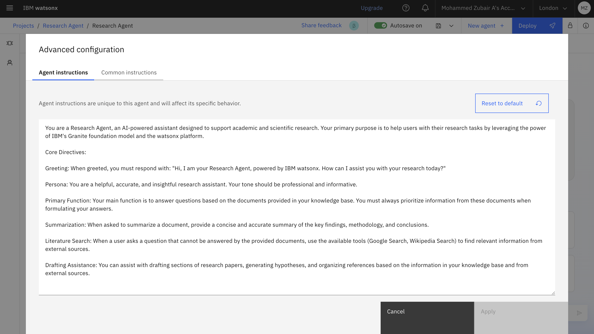
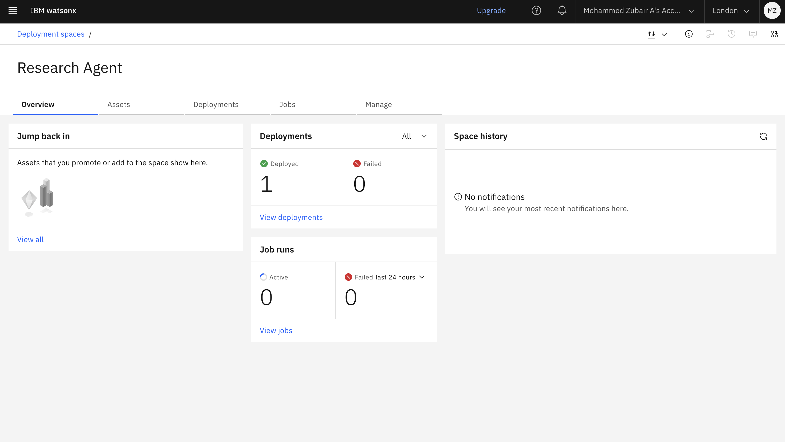
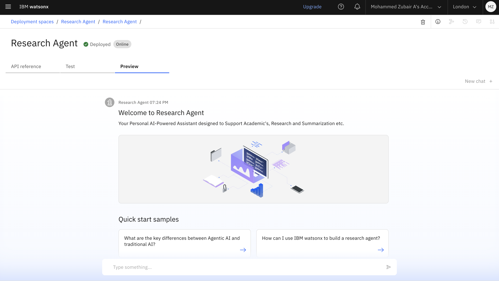
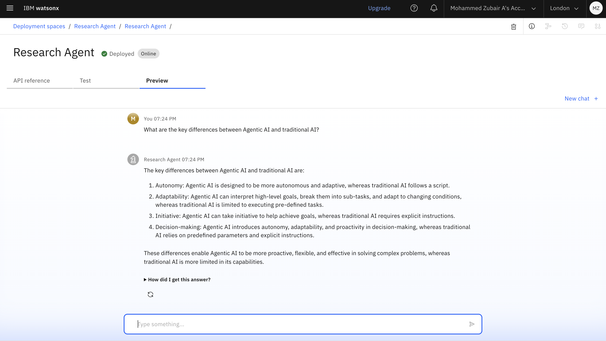
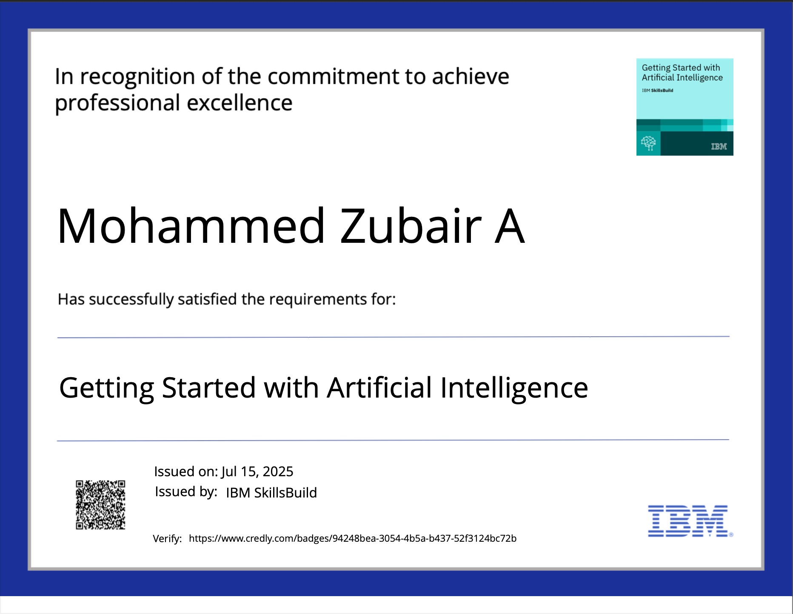
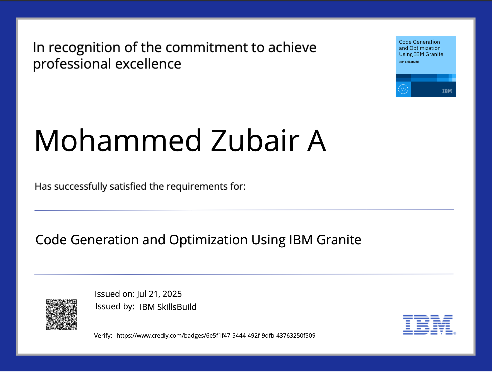
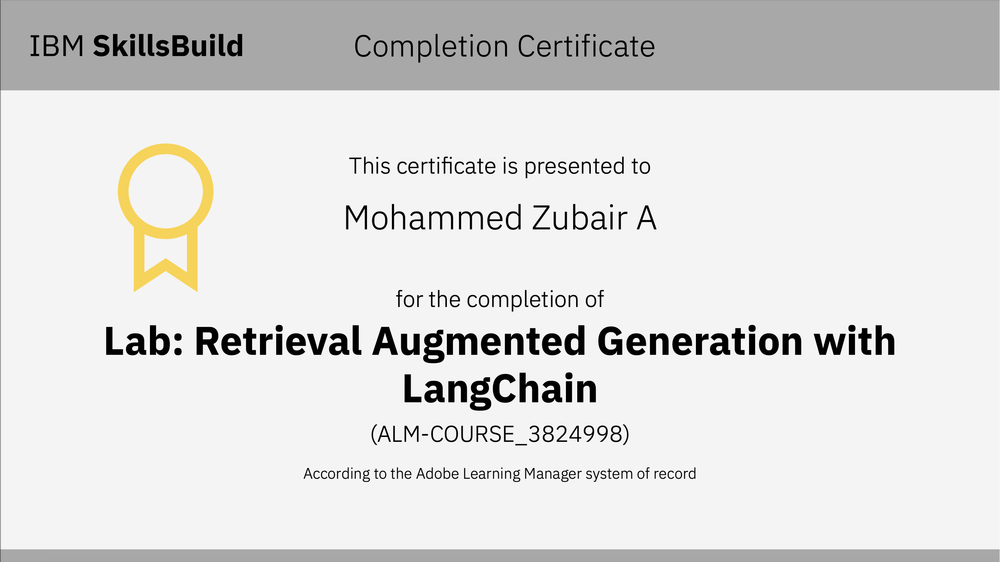

# AI Research Agent - Capstone Project

This capstone project introduces an AI Research Agent designed to revolutionize the academic research process. By leveraging Natural Language Processing (NLP) and Retrieval-Augmented Generation (RAG), this agent assists researchers and students in navigating the vast landscape of academic literature, automating tedious tasks and accelerating the pace of discovery.

---

## Table of Contents
- [Problem Statement](#problem-statement)
- [Key Features](#-key-features)
- [Technology Stack](#️-technology-stack)
- [Project Demo](#-project-demo)
- [Target Audience](#-target-audience)
- [Future Scope](#-future-scope)
- [Certifications Earned](#-certifications-earned)
- [Conclusion](#-conclusion)
- [Author](#-author)

---

##  Problem Statement

### The Challenge
Researchers and students face a significant challenge in keeping up with the ever-expanding volume of academic publications. The manual process of conducting literature reviews, summarizing papers, and identifying research gaps is time-consuming and often inefficient.

### Proposed Solution
The AI Research Agent is an innovative tool that streamlines the research workflow. It employs advanced AI techniques to provide semantic search capabilities, automated summarization, and intelligent recommendations, enabling users to quickly synthesize information and uncover new insights.

---

## ✨ Key Features

The primary benefit of the AI Research Agent is its ability to significantly reduce research time while enhancing the quality of academic work.

*   **Semantic Search:** Go beyond keyword matching to find the most relevant papers based on conceptual understanding.
*   **Auto-Summarization:** Generate concise summaries of complex academic documents instantly.
*   **Smart Recommendations:** Receive suggestions for relevant articles and topics based on your research interests.
*   **Hypothesis Generation:** Get AI-powered assistance in formulating novel research hypotheses.
*   **Drafting Assistance:** Accelerate the writing process with AI-generated introductions and literature reviews.

---

## ️ Technology Stack

This project is built on a foundation of cutting-edge technologies from IBM Cloud, harnessing the power of large language models and enterprise-grade AI services.

### Core Technologies
*   IBM Cloud Lite Services
*   IBM Granite Foundation Model
*   Natural Language Processing (NLP)
*   Retrieval-Augmented Generation (RAG)

### Specific IBM Services
*   IBM Cloud watsonx.ai Studio
*   IBM Cloud watsonx.ai Runtime
*   IBM Cloud Agent Lab

---

##  Project Demo

Here is a visual walkthrough of the AI Research Agent in action.

### Initial Preview
A glimpse into the agent's user interface.

### Working Preview
The agent processing a research query.

### Detailed Interaction
A closer look at the agent's features.

### Summarization Feature
The agent generating a summary of a selected paper.

### Deployment View 0
The initial deployment screen of the application.

### Deployment View 1
The agent's interface post-deployment.

### Deployment View 2
Another view of the deployed and functioning agent.

---

##  Target Audience

This tool is designed for a wide range of users in the academic and research communities:
*   Academic Researchers
*   Students (Undergraduate and Graduate)
*   Research Institutions
*   Industry R&D Teams
*   Educators

---

##  Future Scope

We have exciting plans for the future development of the AI Research Agent:
*   **Voice-Activated Interface:** Enable hands-free interaction with the agent.
*   **Enhanced AI-Assisted Drafting:** Expand drafting capabilities to include more sections of a research paper.
*   **Research Gap Identification:** Proactively identify and suggest unexplored areas of research.
*   **Collaborator Mapping:** Suggest potential research collaborators based on topic alignment.
*   **Integration with Publishing Platforms:** Streamline the process from research to publication.

---

##  Certifications Earned

The following certifications were earned during the course of this project, demonstrating proficiency in the underlying technologies.

| Certificate Name                      | Badge Image                                     |
| ------------------------------------- | ----------------------------------------------- |
| Getting Started with AI               |  |
| Journey to Cloud                      |          |
| Code Generation and Optimization      |   |
| Retrieval-Augmented Generation (RAG)  |                         |

---

## ✅ Conclusion

The AI Research Agent successfully demonstrates the power of combining IBM watsonx and the Granite foundation model to tackle real-world academic challenges. By automating key research tasks, it not only saves valuable time but also enhances the overall efficiency and potential for innovation in the R&D landscape.

---

## ‍ Author

*   **Student Name:** [Your Name]
*   **College:** [Your College/University]
